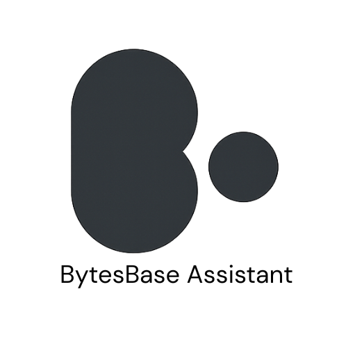

<div
  align="center">
   
</div>

<div align="center">
  <h3>Bytes Base Assistant — Production grade RAG System</h3>
</div>

<div align="left">
  
 
 
 

[](https://github.com/YUGESHKARAN/Assistant_Knowledge_Hub/issues)
[](https://github.com/YUGESHKARAN/Assistant_Knowledge_Hub/issues?q=is%3Aissue+is%3Aclosed)
 
[](https://github.com/YUGESHKARAN/Assistant_Knowledge_Hub/pulls?q=is%3Apr+is%3Aclosed)

</div>


A production grade AI assistant [@BytesBase](https://github.com/YUGESHKARAN/Tech-Community-App) platform. This microservice implements a Retrieval-Augmented Generation (RAG) architecture supported through AGUI and A2UI protocols.

- Ingestion pipeline: ingests user posts, converts them to vector embeddings using OpenAI's `text-embedding-3-small` (dim: 512), and stores vectors + metadata in a Pinecone index.
- Query pipeline: converts user questions to embeddings, performs similarity search against Pinecone to retrieve top-k relevant chunks, and uses those chunks as context (plus role-specified prompts) to generate LLM responses.

This repository contains the core utilities for embedding, Pinecone integration, ingestion, retrieval, prompt templates and a minimal app interface.

Contents
- Brief overview (quickstart)
- Detailed architecture & flow
- Running locally (install, env, commands)
- Pipelines (ingest & query) — implementation notes
- Request / response schema & examples
- Production notes, observability & security
- Contributing & license

---


## Brief (Quickstart)

1. Create a `.env` file with your OpenAI and Pinecone credentials (see "Environment variables").
2. Install dependencies:
   - pip install -r requirements.txt
3. Start the app or run the scripts:
   - Check `app.py` for HTTP endpoints (ingest / query) to test queries.
4. Ingestion converts posts into 521-dimensional vectors using `text-embedding-3-small` and stores them in Pinecone along with metadata.
5. Querying converts the question to an embedding, does a top-k similarity search in Pinecone, retrieves chunks, and asks the LLM to generate a JSON response with content, suggested posts, and suggestions.

---

## Architecture & Data Flow

1. Data Ingestion
   - Source: community posts (title, body, images, links, author, category, postId, profile, etc.).
   - Text is chunked / normalized (see `schema.py` for structure).
   - Embedding: `embedder.py` calls OpenAI's `text-embedding-3-small` (embedding dim = 512).
   - Storage: `pinecone_client.py` upserts embeddings with metadata into a Pinecone index (index config and namespace are set via env vars).

2. Query / Retrieval
   - Input: user question (`query`, `current_post_id`, `category`).
   - Query embedding: same `text-embedding-3-small`.
   - Similarity search: Pinecone similarity search returns top-k matching chunks.
   - LLM response: LLM generates a structured JSON (see schema below). The response is returned to the user.

---

## Install & Run

1. Clone the repository:
   ```
   git clone https://github.com/YUGESHKARAN/Assistant_Knowledge_Hub.git
   cd Assistant_Knowledge_Hub
   ```

2. Install dependencies:
   ```
   pip install -r requirements.txt
   ```

3. Configure `.env` (at repo root or as expected by the code). Example:
   ```env
   # Model keys
   GROQ_API_KEY = your_llm_model_key # here using the model openai/gpt-oss-120b
   OPENAI_API_KEY = your_openai_key # embed model api key, here using text-embedding-3-small
   
   # Pinecone keys
   PINECONE_API_KEY = your_pinecone_key
   PINECONE_INDEX = your_index_name
   
   # Other keys - must for production
   FRONTEND_END_URL = frontend_origin # prevent CSRF attack
   MAX_QUERY_LENGTH = 800             # input max-context (query guardrail)
   JWT_SECRET = your_jwt_auth_hashKey # secure authentication
   ```

4. Run Command:
   ```bash
   python app.py
   ```
   default host: http://localhost:5000/

5. Query Server:
   - POST /ask  (body: {"query": "...", "current_post_id": "...", "category":"..."})
   - POST /ingest (to ingest individual posts via HTTP) — if implemented
   - Example (assumes a `/ask` endpoint — confirm by reading `app.py`):
     ```bash
     curl -X POST http://localhost:5000/ask \
       -H "Content-Type: application/json" \
       -d '{"query":"summarize it, suggest post content", "current_post_id":"689c1079f0093cfba6c981d5", "category":"GenAI"}'
     ```

6. Ingest data:
   -  `ingestion.py` which performs ingestion:
   -  Ingest data format - designed for Tech Community platform:
     ```json
     {
       "title": "",
       "image": "",
       "links": [],
       "documents": [],
       "description": "",
       "category": "",
       "_id": "",
       "authorName": "",
       "authoremail": "",
       "profile": ""
     }
     ```
   - Ingested JSON data is embed using `embedder.py` and upsert into Pinecone via `pinecone_client.py`.

---

## Important files / modules

- utility/config.py — environment & configuration
- utility/schema.py — expected data schema and types
- embedder.py — OpenAI embedding calls
- pinecone_client.py — Pinecone index client, upsert, query helpers
- ingestion.py — ingestion pipeline runner
- retrieval.py — query pipeline, retrieval + LLM prompting flow
- app.py — application entry / HTTP API handlers
- requirements: requirements.txt

---

## Sample Query Input

A typical query payload:
```json
{
  "query": "summarize it, suggest post content",
  "current_post_id": "689c1079f0093cfba6c981d5",
  "category":"GenAI"
}
```
This instructs the system to summarize the content related to `current_post_id` and propose suggested posts or content ideas.

---

## Request / Response Schema

The system produces a JSON response designed for clients that render posts, suggestions, and optional videos. Example response:

Sample response produced by the LLM:
```json
{
  "content": "## Evaluating LLMs using LangSmith\n\nJust wrapped up a comprehensive evaluation ...",
  "posts": [
    {
      "authorEmail": "yugeshkaran01@gmail.com",
      "authorName": "Yugesh Karan",
      "category": "GenAI",
      "image": "IMG-20250317-WA0008.jpg",
      "links": [
        {"title":"new links 2: test h", "url":"new links 2: test h"},
        {"title":"YouTube: https://youtu.be/_ZvnD73m40o?si=6pbeG2cBhblMB89M", "url":"https://youtu.be/_ZvnD73m40o?si=6pbeG2cBhblMB89M"},
        {"title":"YouTube: https://youtu.be/ScKCy2udln8?si=fSc5H1dJy8xGrwSR", "url":"https://youtu.be/ScKCy2udln8?si=fSc5H1dJy8xGrwSR"}
      ],
      "postId": "67d83a9be0acac6d68d558cf",
      "profile": "4264684b-2286-4ff5-8f43-da163fb980d7-blog9.jpg",
      "title": "Prompt template structure"
    }
  ],
  "suggestions": [
    "How to evaluate LLMs in real-world applications?",
    "What are the key components of a RAG system?",
    "How does LangSmith enhance LLM performance?"
  ],
  "type": "post_suggestions",
  "videos": null
}
```

Field explanations:
- content: Markdown-formatted summary or explanation generated by the LLM.
- posts: Array of suggested or related posts (each contains metadata such as title, author, postId, images, links).
- suggestions: short follow-up questions/ideas for posts or further reading.
- type: text, text_video, post_suggestions.
- videos: optional video list or null.

---

## Implementation Notes & Best Practices

- Embedding model: `text-embedding-3-small` — ensure you use the same encoder for both ingestion and querying to keep vector spaces consistent.
- Embedding dimension: 512. When creating Pinecone index, make sure the vector dimension is set accordingly.
- Upsert metadata: store `postId`, `authorEmail`, `authorName`, `category`, `title`, `url`/`links`, chunk id / offset. Metadata ensures you can rehydrate results into structured post objects.
- Top-k retrieval: tune `k` (default often between 3–10) depending on chunk size and retrieval quality.
- Prompting: combine retrieved chunks with system & role prompts. Keep prompts deterministic and include instructions for JSON-only output if you want strict machine-parsable results.
- Chunking & overlap: choose chunk size & overlap to balance context quality vs. retrieval noise.
- Pinecone namespaces: use namespaces to separate environments or tenants.

---

## Contributing

Contributions and improvements are welcome. Follow these steps:
1. Fork the repo
2. Create a new branch (feature/your-change)
3. Open a PR with a clear description of changes

Please keep secrets and API keys out of PRs.

---
